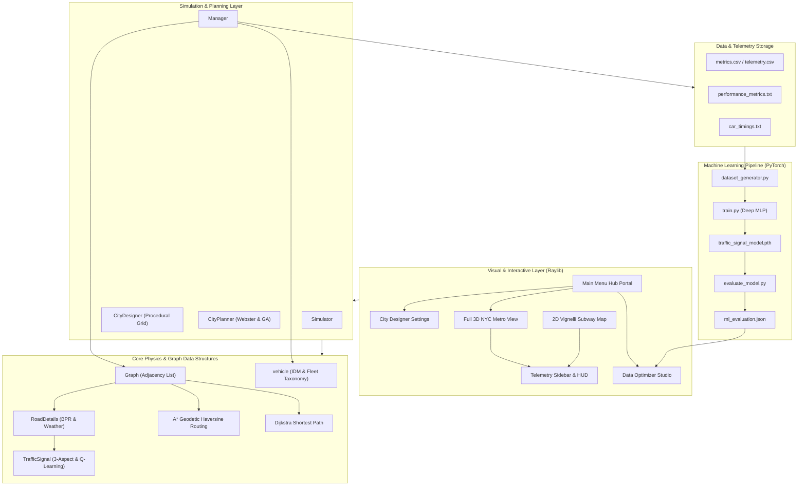

# 🏛️ System Architecture & Codebase Reference

Welcome to the comprehensive architecture specification and file-by-file reference for the **Adaptive Traffic Simulator with Dynamic Rerouting & Signal Control**.

This document describes the design, subsystems, mathematical models, data flows, and an exhaustive breakdown of every file in the project.

---

## 📑 Table of Contents
1. [System Overview & Architecture Diagram](#1-system-overview--architecture-diagram)
2. [Subsystem Breakdown](#2-subsystem-breakdown)
   * [Core Routing & Roadbed Physics (`src/core/`)](#21-core-routing--roadbed-physics-srccore)
   * [City Planning & Simulation Engine (`src/simulation/`)](#22-city-planning--simulation-engine-srcsimulation)
   * [Visualization & Interactive Telemetry (`src/visualization/`)](#23-visualization--interactive-telemetry-srcvisualization)
   * [Machine Learning & Neural Network Pipeline (`ml_pipeline/`)](#24-machine-learning--neural-network-pipeline-ml_pipeline)
   * [Data & Telemetry Storage (`data/`)](#25-data--telemetry-storage-data)
   * [Verification & Testing (`src/tests/`)](#26-verification--testing-srctests)
   * [Technical Specifications (`docs/`)](#27-technical-specifications-docs)
3. [Exhaustive File-by-File Reference](#3-exhaustive-file-by-file-reference)
4. [Mathematical Models & Algorithmic Formulations](#4-mathematical-models--algorithmic-formulations)
5. [End-to-End Execution Lifecycle](#5-end-to-end-execution-lifecycle)

---

## 1. System Overview & Architecture Diagram

The system is organized into modular layers separating graph topology, macroscopic/microscopic traffic physics, optimization algorithms, machine learning models, and 3D/2D graphical rendering.

---

## 2. Subsystem Breakdown

### 2.1 Core Routing & Roadbed Physics (`src/core/`)
Responsible for graph topology representations, dynamic shortest-path computations, link travel-time formulations, and physical vehicle characteristics.
* **Graph Topology**: Templated directed and undirected graph using adjacency lists (`array[i].Neighbors`) with fast vertex-name-to-index caching (`unordered_map<t, int>`).
* **Routing Algorithms**: Dual-engine routing supporting both **Dijkstra's Shortest Path** (for minimum dynamic edge weight) and **A\* Haversine Routing** with an admissible geodetic distance heuristic.
* **Road Link Performance**: Implements the **Bureau of Public Roads (BPR)** polynomial travel-time delay function, incorporating dynamic capacity factors, weather grip reductions, multi-lane capacities, and incident penalties.
* **Traffic Signal Controllers**: Individual 3-aspect signal heads (Red, Yellow, Green) equipped with adaptive minimum/maximum green times, clearance yellow intervals, and an onboard **Q-Learning Max-Pressure Controller**.
* **Vehicle Modeling**: Supports 6 distinct vehicle types (Sedans, Freight Trucks, Buses, Ambulances, EVs, Motorcycles) with microscopic **Intelligent Driver Model (IDM)** parameters, MOBIL lane-selection, fuel consumption models, and toll tracking.

### 2.2 City Planning & Simulation Engine (`src/simulation/`)
Orchestrates multi-agent traffic movements, signal phase switching, and macro-level urban network design.
* **Procedural Network Synthesis**: Automatically builds multi-tier NYC Midtown Manhattan grids (Avenues, Cross Streets, Arterial Diagonals, Perimeter Beltways, and Elevated Flyovers) based on real-world MTA station locations.
* **Signal Timing Optimization**: Features both **Webster’s Minimum Delay Formulation** for analytical baseline signal timing and a **Genetic Algorithm (GA)** optimizer that evolves green splits and cycle lengths across simulated peak-hour demand profiles.
* **Manager Engine**: Central controller handling vehicle departures, queue management at red lights, intersection arrivals, rerouting around incidents, weather conditions, diurnal 24-hour clocks, and electronic M-Tag toll revenue tracking.

### 2.3 Visualization & Interactive Telemetry (`src/visualization/`)
Delivers real-time rendering and interactive user control powered by **Raylib**.
* **100% 3D Perspective Metropolitan World**: Renders multi-level concrete road decks, elevated flyover piers, 3D traffic signal posts with active lens glows, vehicle chassis with projecting headlight cones and brake lights, and glowing station towers with vertical sky laser beacons.
* **2D Vignelli-Style Transit Map**: Schematic subway track diagram rendering with color-coded avenue/street lines, 3-aspect approach signal heads with live countdown timers, and stop-line queue gauges.
* **Dynamic Signal Illumination**: Nodes dynamically pulse and blink in **Emerald Green** (flowing), **Amber Yellow** (clearance), **Ruby Red** (queue stop), or **Cyan/Red Strobe** (emergency preemption).
* **Driver Chase Camera Suite**: Free 3D orbit, top-down tactical orthographic view, street-level view, auto-orbit, and camera tracking locked to any commuter vehicle or emergency ambulance.
* **Control Hub & Data Optimizer Studio**: Interactive screens to inspect live simulation metrics, trigger genetic signal optimization, run PyTorch model inference evaluations, and compare Level of Service (LOS A–F) KPI reports.

### 2.4 Machine Learning & Neural Network Pipeline (`ml_pipeline/`)
Integrates offline deep learning with the live C++ simulation engine.
* **Dataset Generation**: Synthesizes tabular training datasets (`traffic_dataset.csv`) based on simulated vehicle counts, queue depths, historical delays, road capacities, and weather states.
* **Deep Neural Network (`models.py`)**: Multi-task PyTorch architecture featuring residual multi-layer perceptrons (MLP) with batch normalization and dropout to predict optimal cycle lengths, green-split distributions, and segment travel times.
* **Evaluation & Inference Harness (`evaluate_model.py`)**: Computes $R^2$ goodness-of-fit, Mean Absolute Error (MAE), and Level of Service accuracy metrics, exporting results to `data/ml_evaluation.json`.

---

## 3. Exhaustive File-by-File Reference

| Directory | File | Primary Types / Classes | Primary Functions | Description & Role in Architecture |
| :--- | :--- | :--- | :--- | :--- |
| `src/core/` | [`Graph.h`](file:///C:/Users/usman/Downloads/Adaptive-Traffic-Simulator-with-Dynamic-Rerouting-Signal-Control-main/src/core/Graph.h) | `Graph<t, size>`, `weighted` | `insertVertex`, `makeEdge`, `shortest_Path_btw2_vericex_returing_list`, `aStarShortestPath`, `haversineDistanceKm` | Templated adjacency-list graph data structure. Implements Dijkstra min-heap search and A\* Haversine geodetic shortest path algorithms. Maintains GPS coordinates for all vertices. |
| `src/core/` | [`RoadDetails.h`](file:///C:/Users/usman/Downloads/Adaptive-Traffic-Simulator-with-Dynamic-Rerouting-Signal-Control-main/src/core/RoadDetails.h) | `RoadDetails`, `WeatherCondition` | `bestTime`, `NonIdealtime`, `calculateWeight`, `DischargeAllowed`, `processToll`, `setWeather` | Edge weight and physical road model. Computes travel times using BPR congestion curves. Handles adverse weather friction, lane capacities, M-Tag electronic tolling, and blockage incidents. |
| `src/core/` | [`TrafficSignal.h`](file:///C:/Users/usman/Downloads/Adaptive-Traffic-Simulator-with-Dynamic-Rerouting-Signal-Control-main/src/core/TrafficSignal.h) | `TrafficSignal`, `SignalColor`, `SignalControlStrategy` | `Timer`, `turnGreen`, `turnYellow`, `turnRed`, `shouldSwitchQAdaptive`, `triggerEmergencyPreemption` | Physical 3-aspect signal model. Tracks green, yellow, and red timers. Houses an embedded Q-Learning agent that dynamically switches signals based on queue depth and downstream pressure. |
| `src/core/` | [`vehicle.h`](file:///C:/Users/usman/Downloads/Adaptive-Traffic-Simulator-with-Dynamic-Rerouting-Signal-Control-main/src/core/vehicle.h) | `vehicle<t>`, `VehicleType`, `VehicleState` | `updateMicroscopicIDM`, `updateFuelAndEmissions`, `rechargeBattery`, `payToll` | Microscopic vehicle model. Supports 6 vehicle categories. Implements IDM car-following acceleration, MOBIL lane changing, battery state of charge (SoC), and CO2 fuel consumption tracking. |
| `src/core/` | [`Header1.h`](file:///C:/Users/usman/Downloads/Adaptive-Traffic-Simulator-with-Dynamic-Rerouting-Signal-Control-main/src/core/Header1.h) | Global forward declarations | Helper macros | Legacy header wrapper providing common utility includes and standard library namespace symbols. |
| `src/simulation/` | [`CityDesigner.h`](file:///C:/Users/usman/Downloads/Adaptive-Traffic-Simulator-with-Dynamic-Rerouting-Signal-Control-main/src/simulation/CityDesigner.h) | `CityDesignParams`, `NodeSignalState`, `MLEvaluationMetrics`, `NYCCameraControlActions` | `SetupNYCMetroCustomCity`, `GetNodeSignalState`, `DrawFull3DNYCMetroWorld`, `DrawNYCMetroTransitMap`, `DrawNYCMetroProjectedHUD`, `DrawMainMenuHub`, `DrawDataOptimizerInterface`, `DrawCityDesignerSettingsPage` | Core procedural city designer and UI suite. Builds multi-tier NYC Metro networks, evaluates blinking node colors, renders the complete 3D perspective world, and provides all interactive menu screens. |
| `src/simulation/` | [`CityPlanner.h`](file:///C:/Users/usman/Downloads/Adaptive-Traffic-Simulator-with-Dynamic-Rerouting-Signal-Control-main/src/simulation/CityPlanner.h) | `CitySignalTimingPlan`, `CityPlanningReport`, `HCMLOSGrade`, `WebsterEngine`, `CityGeneticSignalOptimizer` | `calculateWebsterPlan`, `optimizeIntersection`, `computeHCMLOS`, `generateComparison` | Urban traffic engineering and signal optimization suite. Implements Webster's baseline formulation, Genetic Algorithm green-split evolution, and HCM 2016 Level of Service classification. |
| `src/simulation/` | [`Manger.h`](file:///C:/Users/usman/Downloads/Adaptive-Traffic-Simulator-with-Dynamic-Rerouting-Signal-Control-main/src/simulation/Manger.h) | `Manager<t, size>` | `addVehicle`, `entrance`, `entraingfromQueetoEdge`, `arrivalAtIntersection`, `reached`, `updateSignals`, `ShortestPath`, `physics` | Central traffic simulation manager. Controls vehicle lifecycles, queue discharge at signals, dynamic rerouting around blocked roads, diurnal clock progression, and CSV metric recording. |
| `src/simulation/` | [`Manager.h`](file:///C:/Users/usman/Downloads/Adaptive-Traffic-Simulator-with-Dynamic-Rerouting-Signal-Control-main/src/simulation/Manager.h) | None | `#include "Manger.h"` | Clean alias header resolving the historical spelling variation between `Manager.h` and `Manger.h`. |
| `src/simulation/` | [`Simulator.h`](file:///C:/Users/usman/Downloads/Adaptive-Traffic-Simulator-with-Dynamic-Rerouting-Signal-Control-main/src/simulation/Simulator.h) | `Simulator<t, size>` | `setupCityLevelNetwork`, `setupFantasyRealmsNetwork`, `optimizeCitySignals`, `addCityCommuterTraffic`, `addFantasyRealmCaravans` | Scenario coordinator. Instantiates graph maps and managers, manages pre-configured multi-city environments, and bridges live simulations to optimization engines. |
| `src/visualization/`| [`Graphics.cpp`](file:///C:/Users/usman/Downloads/Adaptive-Traffic-Simulator-with-Dynamic-Rerouting-Signal-Control-main/src/visualization/Graphics.cpp) | `AppViewState` | `main`, `DrawTrafficSignalHead`, `DrawDetailedVehicle`, `DrawVehicleAndSignalLegend`, `DrawSparkline` | Primary application entry point. Initializes Raylib window, manages 3D/2D cameras, drives the main frame loop, processes keyboard/mouse controls, and orchestrates viewport rendering. |
| `src/visualization/`| [`Graphics.h`](file:///C:/Users/usman/Downloads/Adaptive-Traffic-Simulator-with-Dynamic-Rerouting-Signal-Control-main/src/visualization/Graphics.h) | Function prototypes | Prototypes for `Graphics.cpp` | Header providing forward declarations for 2D/3D visualization helpers and vehicle drawing functions. |
| `src/tests/` | [`test_simulation.cpp`](file:///C:/Users/usman/Downloads/Adaptive-Traffic-Simulator-with-Dynamic-Rerouting-Signal-Control-main/src/tests/test_simulation.cpp) | Test harness | `main` | Headless unit test verifying Dijkstra shortest path, A\* geodetic routing, capacity delay curves, and vehicle arrival accounting without requiring GUI initialization. |
| `include/` | [`raylib.h`](file:///C:/Users/usman/Downloads/Adaptive-Traffic-Simulator-with-Dynamic-Rerouting-Signal-Control-main/include/raylib.h) | Raylib C API | Raylib core functions | Standard Raylib 4.x header for 2D/3D window management, OpenGL drawing, audio, and input handling. |
| `include/` | [`raymath.h`](file:///C:/Users/usman/Downloads/Adaptive-Traffic-Simulator-with-Dynamic-Rerouting-Signal-Control-main/include/raymath.h) | 3D Vector & Matrix math | `Vector3Lerp`, `Vector3Normalize`, etc. | SIMD/inline 3D vector, matrix, and quaternion mathematics used for 3D camera projection and vehicle interpolation. |
| `include/` | [`rlgl.h`](file:///C:/Users/usman/Downloads/Adaptive-Traffic-Simulator-with-Dynamic-Rerouting-Signal-Control-main/include/rlgl.h) | Low-level OpenGL abstraction | Immediate-mode rendering | Raylib OpenGL abstraction layer for custom geometry, shader uniforms, and render states. |
| `ml_pipeline/` | [`dataset_generator.py`](file:///C:/Users/usman/Downloads/Adaptive-Traffic-Simulator-with-Dynamic-Rerouting-Signal-Control-main/ml_pipeline/dataset_generator.py) | Python Script | `generate_synthetic_traffic_dataset` | Generates balanced training datasets reflecting diverse traffic scenarios (off-peak, rush hour, adverse weather, gridlock). |
| `ml_pipeline/` | [`models.py`](file:///C:/Users/usman/Downloads/Adaptive-Traffic-Simulator-with-Dynamic-Rerouting-Signal-Control-main/ml_pipeline/models.py) | `TrafficOptimizationModel` (PyTorch) | `forward` | Multi-output PyTorch neural network predicting optimal cycle lengths, green-split ratios, and road travel times. |
| `ml_pipeline/` | [`train.py`](file:///C:/Users/usman/Downloads/Adaptive-Traffic-Simulator-with-Dynamic-Rerouting-Signal-Control-main/ml_pipeline/train.py) | Python Script | `train_model` | Trains the neural network on `traffic_dataset.csv` using AdamW optimization, learning rate scheduling, and MSE loss. |
| `ml_pipeline/` | [`evaluate_model.py`](file:///C:/Users/usman/Downloads/Adaptive-Traffic-Simulator-with-Dynamic-Rerouting-Signal-Control-main/ml_pipeline/evaluate_model.py) | Python Script | `evaluate_pipeline` | Computes test-set accuracy, MAE, and $R^2$ statistics, and serializes results into `data/ml_evaluation.json`. |
| `ml_pipeline/` | [`predict_and_route.py`](file:///C:/Users/usman/Downloads/Adaptive-Traffic-Simulator-with-Dynamic-Rerouting-Signal-Control-main/ml_pipeline/predict_and_route.py) | Python Script | `predict_timing_and_route` | Inference CLI tool that accepts real-time intersection features and outputs predicted signal timing plans. |
| `data/` | [`metrics.csv`](file:///C:/Users/usman/Downloads/Adaptive-Traffic-Simulator-with-Dynamic-Rerouting-Signal-Control-main/data/metrics.csv) | CSV Telemetry Data | Telemetry logs | Records tick-by-tick simulation metrics: active vehicles, arrived vehicles, average travel time, throughput, and system cost. |
| `data/` | [`ml_evaluation.json`](file:///C:/Users/usman/Downloads/Adaptive-Traffic-Simulator-with-Dynamic-Rerouting-Signal-Control-main/data/ml_evaluation.json) | JSON Metrics Data | Model evaluation metrics | Stores serialized accuracy figures ($R^2$, MAE, % accuracy) consumed by the C++ Data Optimizer interface. |
| `data/` | [`performance_metrics.txt`](file:///C:/Users/usman/Downloads/Adaptive-Traffic-Simulator-with-Dynamic-Rerouting-Signal-Control-main/data/performance_metrics.txt) | Text Log File | Session logs | Human-readable periodic performance reports detailing cumulative delay, LOS grade, CO2 emissions, and fuel burn. |
| `data/` | [`car_timings.txt`](file:///C:/Users/usman/Downloads/Adaptive-Traffic-Simulator-with-Dynamic-Rerouting-Signal-Control-main/data/car_timings.txt) | Text Log File | Vehicle logs | Individual vehicle arrival records listing vehicle ID, origin, destination, elapsed travel ticks, and chosen path. |
| Root | [`CMakeLists.txt`](file:///C:/Users/usman/Downloads/Adaptive-Traffic-Simulator-with-Dynamic-Rerouting-Signal-Control-main/CMakeLists.txt) | CMake Build File | Build targets | Universal build configuration for compiling on Windows, Linux, and macOS. |
| Root | [`RECIPE.md`](file:///C:/Users/usman/Downloads/Adaptive-Traffic-Simulator-with-Dynamic-Rerouting-Signal-Control-main/RECIPE.md) | Markdown Guide | Setup instructions | Step-by-step instructions to compile and run the project on any machine. |
| Root | [`requirements.txt`](file:///C:/Users/usman/Downloads/Adaptive-Traffic-Simulator-with-Dynamic-Rerouting-Signal-Control-main/requirements.txt) | Pip Requirements | Dependencies | Python dependencies for the machine learning optimization and evaluation pipeline. |

---

## 4. Mathematical Models & Algorithmic Formulations

### 4.1 Link Travel Time (Bureau of Public Roads Formulation)
The effective travel time $t_e$ on a road link with free-flow travel time $t_0$, vehicle volume $V$, and effective capacity $C_{\text{eff}}$ is modeled as:
$$t_e = t_0 \cdot \left(1 + \alpha \cdot \left(\frac{V}{C_{\text{eff}}}\right)^\beta\right) + P_{\text{incident}}$$
Where:
* $t_0 = \frac{\text{length}}{v_{\text{eff}}}$ (scaled to simulation seconds).
* $C_{\text{eff}} = C \cdot \text{capacityFactor}$ (where $\text{capacityFactor} \in [0.0, 1.0]$ depends on weather and incidents).
* $P_{\text{incident}}$ is a heavy additive penalty diverting dynamic routing during blockages.

### 4.2 A\* Geodetic Haversine Routing
The geodetic distance between two coordinates $(\phi_1, \lambda_1)$ and $(\phi_2, \lambda_2)$ on Earth (radius $R = 6371\text{ km}$) is:
$$d = 2R \cdot \arcsin\left(\sqrt{\sin^2\left(\frac{\Delta\phi}{2}\right) + \cos\phi_1\cos\phi_2\sin^2\left(\frac{\Delta\lambda}{2}\right)}\right)$$
The heuristic function $h(u)$ estimating remaining travel time to destination $d$ is:
$$h(u) = \frac{d(u, d) \cdot \kappa}{v_{\max}}$$
Because $\kappa \le 1.0$, $h(u) \le t^*(u, d)$, guaranteeing that the heuristic is **admissible** and finds the optimal path.

### 4.3 Webster’s Minimum Delay Signal Formulation
The optimal cycle length $C_0$ minimizing total intersection vehicular delay is:
$$C_0 = \frac{1.5L + 5}{1 - Y}$$
Where:
* $L$ is total lost time per cycle (yellow clearance + all-red intervals).
* $Y = \sum_{i=1}^n y_i = \sum_{i=1}^n \frac{q_i}{s_i}$ is the sum of critical flow ratios across all phases.
Effective green time for phase $i$ is apportioned as:
$$g_i = (C_0 - L) \cdot \frac{y_i}{Y}$$

### 4.4 Q-Learning Max-Pressure Signal Control
The onboard Q-learning signal controller discretizes the approach queue state $s \in \{0, 1, 2, 3\}$ (Low, Moderate, High, Saturated) and selects an action $a \in \{\text{Keep Green}, \text{Switch Phase}\}$.
The Q-value update rule is:
$$Q(s, a) \leftarrow Q(s, a) + \alpha \cdot \left[R + \gamma \max_{a'} Q(s', a') - Q(s, a)\right]$$
Where reward $R = (q_{t-1} - q_t) - 3.0 \cdot \mathbb{I}(\text{downstreamPressure} > 15)$, rewarding queue clearance and penalizing downstream spillback.

---

## 5. End-to-End Execution Lifecycle

Each frame of the simulation executes the following pipeline:

1. **User Input Processing**:
   * Mouse drags and wheel movements update camera angles, pitch, and zoom.
   * Keypresses toggle playback pause, simulation speed, preset loading, or vehicle dispatches.
2. **Simulation Step Advancement**:
   * Time advances by `dt = 0.10f * speedMultiplier` per step.
   * `advanceClock()` progresses the 24-hour diurnal lighting cycle.
   * `updateSignals()` checks emergency vehicle approaches, updates signal countdowns, and executes phase transitions.
3. **Vehicle Physics & State Transitions**:
   * Vehicles en-route (`state = 1`) decrement `timeRemaining` and advance longitudinal position.
   * `reached()` checks if vehicles completed their final hop; records arrival metrics and removes them.
   * `arrivalAtIntersection()` checks if intermediate hops completed; joins queue if next signal is Red, or proceeds if Green.
   * `entraingfromQueetoEdge()` discharges waiting vehicles from queues when signals turn Green.
   * Dynamic traffic generation injects new commuter trips if active count falls below target.
4. **Rendering Pipeline**:
   * **3D Mode**: Draws terrain grid, elevated bridge piers, road decks in congestion colors, 3D signal posts with lit lenses, 3D vehicles with headlights, and station towers with blinking halos and sky laser beacons.
   * **HUD Mode**: Projects 2D screen-space station labels, live signal countdown timers (`GRN`, `YEL`, `RED`, `EMS`), and queue depth badges.
   * **Telemetry Sidebar**: Draws sparklines, throughput counters, fuel/CO2 readouts, and camera control buttons.
