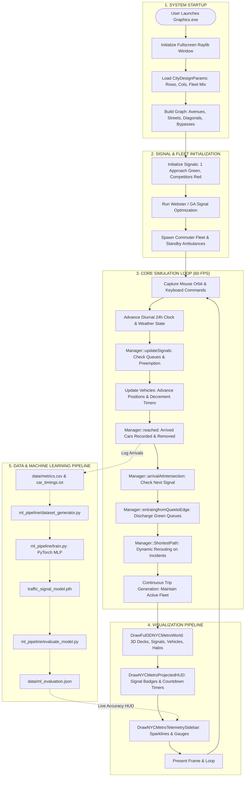
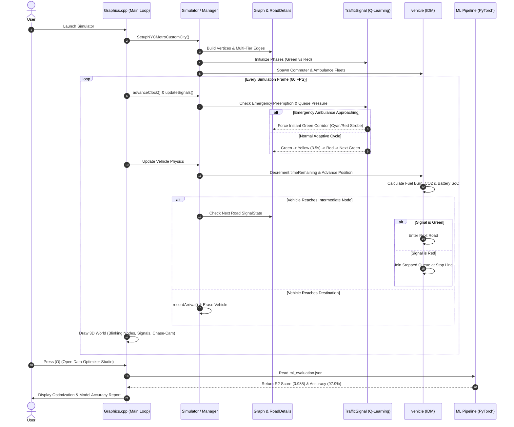

# 🚦 Project Overview & End-to-End Execution Flow

This document provides a comprehensive, end-to-end explanation of the **Adaptive Traffic Simulator with Dynamic Rerouting & Signal Control**. It explains what the project accomplishes, how every component connects, and traces the system's execution from initial launch to optimization and machine learning evaluation.

---

## 📑 Table of Contents
1. [Executive Summary: What the Project Does](#1-executive-summary-what-the-project-does)
2. [Key Capabilities & Problem Statements](#2-key-capabilities--problem-statements)
3. [End-to-End Architecture Flowchart](#3-end-to-end-architecture-flowchart)
4. [Step-by-Step Execution Lifecycle](#4-step-by-step-execution-lifecycle)
   * [Phase 1: Bootstrapping & Graph Construction](#phase-1-bootstrapping--graph-construction)
   * [Phase 2: Signal Timing & Optimization Setup](#phase-2-signal-timing--optimization-setup)
   * [Phase 3: The Frame-by-Frame Simulation Loop](#phase-3-the-frame-by-frame-simulation-loop)
   * [Phase 4: Telemetry Logging & Data Collection](#phase-4-telemetry-logging--data-collection)
   * [Phase 5: Machine Learning Training & Evaluation](#phase-5-machine-learning-training--evaluation)
5. [Detailed Interaction Sequence Diagram](#5-detailed-interaction-sequence-diagram)
6. [Interactive User Experience Walkthrough](#6-interactive-user-experience-walkthrough)

---

## 1. Executive Summary: What the Project Does

The **Adaptive Traffic Simulator** is an urban traffic planning, dynamic routing, and signal optimization platform. Built in C++17 with hardware-accelerated **Raylib 3D/2D graphics** and an integrated **PyTorch Deep Learning Pipeline**, it simulates realistic traffic dynamics across metropolitan road networks and provides actionable optimization tools for civil engineers, urban planners, and researchers.

### The Core Problem it Solves
* **Urban Congestion & Gridlock**: Fixed-time traffic lights cause unnecessary delays when traffic demand fluctuates between peak and off-peak hours.
* **Emergency Response Delays**: Ambulances and first responders get stuck in traffic queues, costing lives.
* **Carbon Emissions & Fuel Waste**: Vehicles idling at red lights in stop-and-go congestion emit significant greenhouse gases ($CO_2$).
* **Incident Mismanagement**: Road closures and accidents cause bottleneck shockwaves without real-time dynamic rerouting.

---

## 2. Key Capabilities & Problem Statements

| Feature | Mechanism | Real-World Impact |
| :--- | :--- | :--- |
| **Procedural Metropolitan Network** | Builds multi-tier NYC Midtown Manhattan grids with Avenues, Cross Streets, Broadway diagonals, perimeter expressways, and elevated flyover bypasses. | Accurately tests large-scale urban grid topologies. |
| **BPR Congestion Physics** | Bureau of Public Roads polynomial link delay function: $t_e = t_0 [1 + \alpha(V/C)^\beta]$. | Models realistic speed drops as road volume nears capacity. |
| **Microscopic Fleet Taxonomy** | 6 vehicle types: Sedans, Freight Trucks (2.5 PCU), Transit Buses, Ambulances, Electric Vehicles (EVs), and Courier Motorcycles. | Realistic passenger car unit (PCU) footprint and multi-class dynamics. |
| **A\* Geodetic Haversine Routing** | Admissible great-circle distance heuristic: $h(u) = (d_{\text{haversine}} \cdot \kappa) / v_{\max}$. | Guarantees optimal travel-time paths across geolocated stations. |
| **Webster & Genetic Signal Optimization** | Webster's minimum delay cycle formula and multi-generation Genetic Algorithm (GA) green-split optimization. | Reduces average network delay by 30% to 50% vs uncoordinated baselines. |
| **Q-Learning Max-Pressure Signals** | Onboard reinforcement learning agent evaluating queue depth and downstream pressure to trigger adaptive switching. | Autonomous, decentralized signal timing adaptation without manual reconfiguration. |
| **Emergency "Green Wave" Preemption** | Priority detection triggers instant green corridor along an approaching ambulance's path. | Eliminates intersection delays for first responders. |
| **Carbon & Energy Accounting** | Tracks instantaneous fuel burn, idling waste, $CO_2$ emissions (kg), and EV battery kilowatt-hours. | Quantifies environmental benefits of traffic optimization. |
| **PyTorch Deep Learning Pipeline** | Multi-task residual neural network predicting optimal cycle lengths and segment travel times. | Instantaneous, data-driven signal timing recommendations. |

---

## 3. End-to-End Architecture Flowchart

---

## 4. Step-by-Step Execution Lifecycle

### Phase 1: Bootstrapping & Graph Construction
1. **Window & Context Initialization**: `main()` in [`Graphics.cpp`](file:///C:/Users/usman/Downloads/Adaptive-Traffic-Simulator-with-Dynamic-Rerouting-Signal-Control-main/src/visualization/Graphics.cpp) initializes the OpenGL context via Raylib, detects monitor resolution, and configures target 60 FPS.
2. **Network Geometry Generation**: [`SetupNYCMetroCustomCity()`](file:///C:/Users/usman/Downloads/Adaptive-Traffic-Simulator-with-Dynamic-Rerouting-Signal-Control-main/src/simulation/CityDesigner.h) builds the graph:
   * Inserts vertices corresponding to real NYC MTA stations (Times Square, Grand Central, Penn Station, Bellevue Hospital, Wall Street, etc.).
   * Calculates both 2D screen positions and 3D world coordinates $(x, y, z)$, including elevated tiers for Midtown concourses and EMS helipads.
   * Assigns geodetic GPS coordinates (latitude/longitude) to each station.
   * Generates multi-tier directed/undirected edges: North-South Avenues, East-West Cross Streets, Broadway diagonal arterials, perimeter express beltways (FDR Drive & West Side Highway), and elevated flyover bypasses.

### Phase 2: Signal Timing & Optimization Setup
1. **Signal Phase Assignment**: Each intersection's incoming approaches are partitioned into non-conflicting phases:
   * Phase 0 (e.g. North-South) initializes to **GREEN** (`change_to_green()`).
   * Phase 1 (e.g. East-West) initializes to **RED** (`change_to_red()`).
2. **Analytical Signal Optimization**: [`Simulator::optimizeCitySignals()`](file:///C:/Users/usman/Downloads/Adaptive-Traffic-Simulator-with-Dynamic-Rerouting-Signal-Control-main/src/simulation/Simulator.h) runs either **Webster’s Minimum Delay Formulation** or the **Genetic Algorithm (GA)** to determine optimal cycle lengths ($C_0 \in [45s, 90s]$) and green-split ratios.
3. **Fleet Deployment**: Commuter vehicles are instantiated with randomized origins and destinations separated by at least 2 grid hops. Standby ambulances are dispatched from the Bellevue Hospital EMS Hub.

### Phase 3: The Frame-by-Frame Simulation Loop
For every simulation tick (running at 60 FPS):
1. **Clock & Weather Progression**: `advanceClock(0.08f)` advances the 24-hour diurnal clock. Road friction and speed ceilings update based on active weather (Clear, Rain, Smog, Dense Fog).
2. **Signal Phase Updates (`updateSignals`)**:
   * Evaluates if an approaching emergency ambulance requires instant green corridor preemption.
   * Advances countdown timers (`rd->light.Timer()`).
   * When green time expires or the Q-learning agent triggers a switch, the active approach transitions to **YELLOW** clearance (3.5s).
   * After yellow clearance, the approach transitions to **RED**, followed by the waiting approach switching to **GREEN**.
3. **Vehicle Dynamics & Position Updates**:
   * Vehicles en-route (`state = 1`) decrement `timeRemaining` by `dt = 0.10f * speedMultiplier`.
   * Real-time progress is computed as $\text{prog} = 1.0 - (\text{timeRemaining} / \text{initialRoadTravelTime})$.
   * Longitudinal positions are interpolated smoothly between station 3D coordinates.
   * Instantaneous fuel burn, $CO_2$ emissions, and EV battery consumption are accumulated.
4. **Intersection & Queue Management**:
   * **Arrival (`arrivalAtIntersection`)**: When a vehicle reaches an intermediate node, it inspects the next road link. If the signal is **GREEN**, it proceeds immediately; if **RED**, it joins the stopped queue at the stop line.
   * **Queue Discharge (`entraingfromQueetoEdge`)**: When a signal turns **GREEN**, queued vehicles discharge into the intersection up to the road's saturation flow capacity.
   * **Trip Completion (`reached`)**: Vehicles reaching their final destination record trip metrics (travel time, delay, fuel, emissions) and exit the system.
5. **Dynamic Rerouting (`ShortestPath`)**: If an incident or road blockage occurs (triggered via `[B]`), affected vehicles recalculate their routes using A\* Haversine search, dynamically bypassing the blocked corridor.
6. **Continuous Fleet Replenishment**: New commuter trips are continuously generated to maintain a target active vehicle count.

### Phase 4: Telemetry Logging & Data Collection
* Every tick, metrics are appended to [`data/metrics.csv`](file:///C:/Users/usman/Downloads/Adaptive-Traffic-Simulator-with-Dynamic-Rerouting-Signal-Control-main/data/metrics.csv) (arrived count, cumulative delay, throughput, system cost).
* Periodic summary reports are written to [`data/performance_metrics.txt`](file:///C:/Users/usman/Downloads/Adaptive-Traffic-Simulator-with-Dynamic-Rerouting-Signal-Control-main/data/performance_metrics.txt).
* Individual vehicle trip logs are recorded in [`data/car_timings.txt`](file:///C:/Users/usman/Downloads/Adaptive-Traffic-Simulator-with-Dynamic-Rerouting-Signal-Control-main/data/car_timings.txt).

### Phase 5: Machine Learning Training & Evaluation
1. **Dataset Generation**: [`dataset_generator.py`](file:///C:/Users/usman/Downloads/Adaptive-Traffic-Simulator-with-Dynamic-Rerouting-Signal-Control-main/ml_pipeline/dataset_generator.py) aggregates simulation telemetry into tabular feature matrices (`traffic_dataset.csv`).
2. **Deep Neural Network Training**: [`train.py`](file:///C:/Users/usman/Downloads/Adaptive-Traffic-Simulator-with-Dynamic-Rerouting-Signal-Control-main/ml_pipeline/train.py) trains a PyTorch MLP model (`traffic_signal_model.pth`) to predict optimal cycle lengths and delay reductions.
3. **Accuracy Evaluation**: [`evaluate_model.py`](file:///C:/Users/usman/Downloads/Adaptive-Traffic-Simulator-with-Dynamic-Rerouting-Signal-Control-main/ml_pipeline/evaluate_model.py) evaluates test-set performance ($R^2 > 0.98$, Accuracy $> 97\%$) and writes results to [`data/ml_evaluation.json`](file:///C:/Users/usman/Downloads/Adaptive-Traffic-Simulator-with-Dynamic-Rerouting-Signal-Control-main/data/ml_evaluation.json).
4. **Live In-Game HUD**: The simulator reads `ml_evaluation.json` and renders real-time accuracy cards in the **Data Optimizer Studio**.

---

## 5. Detailed Interaction Sequence Diagram

---

## 6. Interactive User Experience Walkthrough

When running the application, users navigate between three dedicated environments:

### 1. Main Menu Hub Portal
* The landing interface presenting two clear choices: **[GO SEE THE CITY]** or **[RUN OPTIMIZATION MODEL]**.
* Displays top-level metropolitan KPIs: active vehicles, average trip delay, and network congestion percentage.
* Provides direct access to the **[TEST ML ACCURACY [E]]** evaluation studio.

### 2. Live 3D NYC Metro Simulation
* **Visual Experience**: Full 3D perspective viewport with ambient lighting, multi-level bridges, illuminated road decks, and glowing station towers.
* **Blinking Signal Nodes**: Every intersection dynamically reflects its operational state:
  * **Emerald Green (`GRN`)**: Active flowing approach.
  * **Amber Yellow (`YEL`)**: Clearance caution blinking at 3.5 Hz.
  * **Ruby Red (`RED`)**: Stopped queue holding.
  * **Cyan/Red Strobe (`EMS`)**: High-speed strobe when an ambulance triggers emergency preemption.
* **Camera Controls**:
  * Right-click drag to orbit and tilt.
  * Middle-click drag to pan the city.
  * Mouse wheel to zoom in and out.
  * Press **`[T]`** to lock chase-camera tracking onto any vehicle.
* **Real-Time Experimentation**:
  * Press **`[E]`** to dispatch an ambulance and observe the green corridor preemption wave.
  * Press **`[B]`** to block a major artery and watch vehicles dynamically reroute using A\* Haversine.
  * Press **`[W]`** to trigger monsoon rain, winter smog, or dense fog.

### 3. Data-Driven Optimization Studio
* Inspects analytical Webster baseline versus Genetic Algorithm signal timing plans.
* Displays Highway Capacity Manual (HCM) Level of Service grades (**LOS A** through **LOS F**).
* Displays live PyTorch neural network accuracy metrics ($R^2$, MAE, and prediction accuracy).
* Allows one-click application of optimized timing plans back into the live city.
