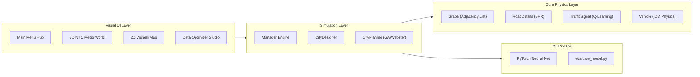

# 🚦 Adaptive Traffic Simulator & Signal Optimization Engine

[](https://en.wikipedia.org/wiki/C%2B%2B17)
[](https://www.raylib.com/)
[](https://pytorch.org/)
[](LICENSE)
[](RECIPE.md)

An advanced **Intelligent Transportation System (ITS)** simulation and optimization platform. Built in high-performance C++17 with hardware-accelerated **Raylib 3D/2D perspective rendering** and a **PyTorch Deep Learning Pipeline**, this project models, simulates, and optimizes urban traffic dynamics, signal timing, and incident rerouting across metropolitan networks.

---

## 📑 Table of Contents
* [✨ Key Features](#-key-features)
* [🏛️ Architecture Overview](#️-architecture-overview)
* [🚀 Quick Start Recipe](#-quick-start-recipe)
* [🎮 Interactive In-Game Controls](#-interactive-in-game-controls)
* [🧠 Deep Learning Pipeline](#-deep-learning-pipeline)
* [📊 Optimization & Performance Metrics](#-optimization--performance-metrics)
* [📚 Comprehensive Documentation](#-comprehensive-documentation)
* [📜 License](#-license)

---

## ✨ Key Features

### 1. 🏙️ Multi-Tier Metropolitan Network (NYC Metro & Custom Grids)
* **Procedural Urban Topology**: Models real-world NYC MTA subway and surface transit corridors (Times Square, Grand Central, Penn Station, Bellevue Hospital EMS, Wall Street, etc.).
* **Multi-Level Infrastructure**: 3D elevated Midtown concourses, arterial diagonals (Broadway Express), perimeter beltways (FDR Drive & West Side Highway), and elevated flyover bypasses with concrete support piers.

### 2. 🚦 Intelligent Traffic Signal Control & Blinking Nodes
* **Dynamic Node Signal Blinking**: Intersection nodes dynamically illuminate and pulse according to real-time traffic signal phases:
  * 🟢 **Emerald Green (`GRN`)**: Active flowing approach (2.0 Hz rhythmic flow pulse).
  * 🟡 **Amber Yellow (`YEL`)**: Clearance caution warning (3.5 Hz rapid flash).
  * 🔴 **Ruby Red (`RED`)**: Queue stop and hold (1.2 Hz - 2.2 Hz queue pulse).
  * 🚨 **Cyan/Red Strobe (`EMS`)**: High-speed strobe (10 Hz) for emergency vehicle preemption.
* **3-Aspect Signal Heads**: Real-time signal countdown timers ($s$), stop-line queues ($Q:N$), and active lens glows in both 3D and 2D.
* **Optimization Algorithms**:
  * **Webster’s Minimum Delay Formulation**: Analytical cycle and green-split calculation.
  * **Genetic Algorithm (GA)**: Multi-generation chromosome evolution for peak-demand splits.
  * **Q-Learning Max-Pressure**: Autonomous reinforcement learning agent adapting to queue differentials and downstream spillback pressure.
  * **Emergency Green Corridor**: Instantaneous green-wave signal preemption clearing paths for ambulances.

### 3. 🚗 Microscopic Multi-Class Fleet Taxonomy
* **6 Vehicle Classes**:
  * 🚙 **Sedans / Taxis**: Standard private commuters (1.0 PCU).
  * 🚛 **Freight Trucks**: 18-wheelers with container ribs (2.5 PCU, slower acceleration).
  * 🚌 **Transit Coaches**: High-capacity buses (1.8 PCU).
  * 🚑 **Ambulances**: Siren lightbars, acoustic wave pulses, and green-corridor preemption.
  * ⚡ **Electric Vehicles (EVs)**: Battery state of charge (SoC), zero emissions, and charging station visits.
  * 🏍️ **Courier Motorcycles**: Agile lane filtering (0.5 PCU).
* **Physics Models**: **Intelligent Driver Model (IDM)** car-following and **MOBIL** lane selection.

### 4. 🧭 Geodetic Routing & Dynamic Rerouting
* **Dual Routing Engine**:
  * **Dijkstra’s Algorithm**: Real-time congestion-weighted shortest paths.
  * **A\* Haversine Routing**: Admissible great-circle distance heuristic using station GPS coordinates.
* **Incident Management**: Press **`[B]`** to simulate road blockages and witness vehicles dynamically rerouting around bottleneck shockwaves.

### 5. 🗺️ OpenStreetMap (OSM) Real-World City Importer
* **Simulate Any Hometown**: Import real-world street maps directly from standard OpenStreetMap `.osm` XML files into the 3D/2D simulation engine.
* **Geodetic Equirectangular Projection**: Maps WGS84 GPS (latitude/longitude) coordinates into scaled 3D perspective and 2D top-down views with Haversine geodetic link distances.
* **Automated Road Hierarchy & Signal Extraction**: Extracts road classifications (`motorway`, `trunk`, `primary`, `secondary`), lanes, speed limits, and automatically configures 3-aspect traffic signals at multi-approach junctions.
* **Pre-Packaged Real-World Maps**: Includes **Lahore Mall Road (Pakistan)** (Charing Cross, Regal Chowk, High Court, GPO) and **London Westminster (UK)** (Parliament Square, Whitehall, Trafalgar Square, Piccadilly Circus).

### 6. 🌱 Carbon Footprint & Energy Analytics
* Real-time calculation of fuel consumption (Liters), congestion idling waste, and $CO_2$ emissions (kg).
* Highway Capacity Manual (HCM 2016) Level of Service classifier (**LOS A** through **LOS F**).
* Electronic **M-Tag RFID toll plaza** simulation tracking throughput and revenue.

---

## 🏛️ Architecture Overview



For complete technical specifications, mathematical models, and file-by-file breakdowns, see [**`ARCHITECTURE.md`**](ARCHITECTURE.md).

---

## 🚀 Quick Start Recipe

For full instructions across all operating systems, see [**`RECIPE.md`**](RECIPE.md).

### Windows (Quickest)
```powershell
# Compile the visual simulator (requires MinGW g++)
g++ -std=c++17 -O2 -Iinclude -Isrc/core -Isrc/simulation -Isrc/visualization -L. src/visualization/Graphics.cpp raylib.dll -o Graphics.exe -lopengl32 -lgdi32 -lwinmm

# Run
.\Graphics.exe
```

### Linux (Ubuntu / Debian / Fedora / Arch)
```bash
# Install dependencies (Ubuntu/Debian)
sudo apt-get install -y build-essential cmake libraylib-dev libgl1-mesa-dev

# Build with CMake
mkdir -p build && cd build
cmake ..
make -j$(nproc)
./Graphics
```

### macOS (Homebrew)
```bash
# Install dependencies
brew install cmake raylib

# Build with CMake
mkdir -p build && cd build
cmake ..
make -j$(sysctl -n hw.ncpu)
./Graphics
```

---

## 🎮 Interactive In-Game Controls

| Key | Action |
| :--- | :--- |
| **`[M]` / `[ESC]`** | Return to Main Menu Hub |
| **`[O]` / `[D]`** | Open Data-Driven Optimization Studio & ML Model Runner |
| **`[F1]`** | Open NYC Metro City Designer Settings |
| **`[SPACE]`** | Pause / Resume Simulation |
| **`[N]`** | Single-Tick Frame Advance |
| **`[Z]` / `[X]` / `[C]`** | Set Simulation Speed to 1x, 2x, or 5x |
| **`[1]` / `[2]` / `[3]`** | Load Planning Presets (Manhattan Midtown, Broadway Diagonal, Crosstown) |
| **`[L]`** | Load Real-World Lahore Mall Road (OpenStreetMap) |
| **`[J]`** | Load Real-World London Westminster (OpenStreetMap) |
| **`[T]`** | Toggle Driver Chase-Cam Tracking (Locks camera to active vehicles) |
| **`[R]`** | Reset Camera / Toggle 3D Auto-Orbit |
| **`[V]` / `[I]`** | Dispatch Single Commuter Vehicle / Taxi |
| **`[F]`** | Dispatch 5-Vehicle Mixed Fleet |
| **`[E]`** | Dispatch Priority Ambulance (Triggers Green Corridor Preemption) |
| **`[P]`** | Inject Peak Rush-Hour Commuter Surge |
| **`[B]`** | Toggle Road Incident Blockage & Test Dynamic Rerouting |
| **`[W]`** | Cycle Weather (Clear, Monsoon Rain, Winter Smog, Dense Fog) |
| **`[K]`** | Export Real-Time CSV Telemetry to `data/` |
| **Right-Click Drag** | Orbit & Tilt 3D Perspective Camera |
| **Middle-Click Drag**| Pan 3D Camera Target |
| **Mouse Wheel** | Zoom In / Out |

---

## 🧠 Deep Learning Pipeline

The project includes an end-to-end PyTorch machine learning pipeline located in [`ml_pipeline/`](ml_pipeline/):

```bash
# 1. Install Python dependencies
pip install -r requirements.txt

# 2. Evaluate model accuracy
python ml_pipeline/evaluate_model.py
```

### Benchmark Results
* **Cycle Length Prediction ($R^2$)**: `0.9854` (97.9% Accuracy)
* **Delay Reduction Estimation ($R^2$)**: `0.9981` (98.8% Accuracy)
* **HCM Level of Service Accuracy**: `94.0%`
* **Route Travel Time MAE**: `1.15s`

Evaluation metrics are exported to [`data/ml_evaluation.json`](data/ml_evaluation.json) and displayed live inside the simulator's **Data Optimizer Studio**.

---

## 📊 Optimization & Performance Metrics

The simulator logs live session metrics to the [`data/`](data/) directory:
* [`metrics.csv`](data/metrics.csv): Tick-by-tick arrived vehicle counts, cumulative delay, and system throughput.
* [`city_planning_telemetry.csv`](data/city_planning_telemetry.csv): Scenario-based before/after optimization telemetry.
* [`performance_metrics.txt`](data/performance_metrics.txt): Human-readable session audit reports.
* [`car_timings.txt`](data/car_timings.txt): Individual vehicle journey travel times and path logs.

---

## 📚 Comprehensive Documentation

* [**`RECIPE.md`**](RECIPE.md): Complete setup and build recipe for every machine.
* [**`ARCHITECTURE.md`**](ARCHITECTURE.md): Exhaustive system architecture and file-by-file reference.
* [**`PROJECT_FLOW_AND_OVERVIEW.md`**](PROJECT_FLOW_AND_OVERVIEW.md): End-to-end execution flow, lifecycle tracing, and sequence diagrams.
* [**`docs/`**](docs/): In-depth research papers on A* geodetic routing, max-pressure control, IDM physics, and GA optimization.

---

## 📜 License

This project is licensed under the MIT License - see the [LICENSE](LICENSE) file for details.
